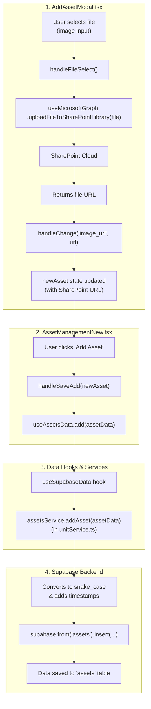

# Asset Upload and Supabase Integration Flow

I've traced the logic for uploading a file to SharePoint and then saving the corresponding asset information, including the SharePoint link, to Supabase. Here is a step-by-step breakdown of the process:

### Data Flow: From UI to Supabase

1.  **File Selection (UI)**: In the `AddAssetModal` component (`src/components/unit-tabs/modals/AddAssetModal.tsx`), when a user selects an image file through the file input, the `handleFileSelect` function is triggered.

2.  **SharePoint Upload**: Inside `handleFileSelect`, the `uploadFileToSharePointLibrary` function is called. This function is provided by the `useMicrosoftGraph` hook (`src/hooks/useMicrosoftGraph.tsx`) and handles the actual file upload to your SharePoint document library.

3.  **URL Retrieval**: Upon a successful upload, the `uploadFileToSharePointLibrary` function returns the direct web URL of the file now stored in SharePoint.

4.  **State Update**: This URL is then saved into the local state of the `AddAssetModal` component. Specifically, it updates the `image_url` property of the `newAsset` state object.

5.  **Submission**: When the user clicks the "Add Asset" button, the `onAdd` prop is called, which executes the `handleSaveAdd` function in the parent `AssetManagement` component (`src/pages/AssetManagementNew.tsx`).

6.  **Data Hook Invocation**: `handleSaveAdd` takes the complete asset data (including the SharePoint `image_url`) and calls the `addAsset` function, which is provided by the `useAssetsData` hook (`src/hooks/useSupabaseData.tsx`).

7.  **Service Layer**: The `useAssetsData` hook is a specialized implementation of the generic `useSupabaseData` hook. Its `add` method resolves to `assetsService.addAsset` located in `src/integrations/supabase/unitService.ts`.

8.  **Supabase Insertion**: The `assetsService.addAsset` function performs the final step. It takes the asset data, converts its property names from camelCase to snake_case to match the database schema, adds a timestamp for `last_updated`, and then uses the Supabase client to insert the new record into the `assets` table.

### Visualization

</rewritten_file> 